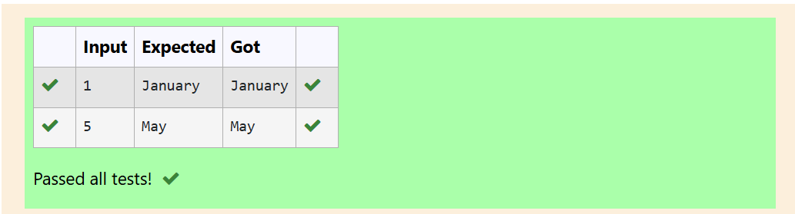

# MODULE-4
---
# EXP NO:16 C PROGRAM TO PERFORM BITWISE AND OPERATION

## Aim:

Write a C program to demonstrate the bitwise AND (&) operation between two integer constants (6 and 7).

## Algorithm:

1. Start.

2. The program does not require user input, as the numbers (6 and 7) are hardcoded constants.

3. The bitwise AND operation (6 & 7) is performed. This operation compares the corresponding bits of 6 and 7, and returns 1 only if both bits are 1.

4. In binary: 6 is 0110 and 7 is 0111.

5. 0110 & 0111 results in 0110 (which is 6 in decimal).

6. Print the result of the bitwise AND operation.

7. Stop.

## Program:
```
#include <stdio.h>
int main()
{
    printf("Bitwise-AND result is = %d", 6 & 7);
    return 0;
}
```

## Output:

## Result:

The C program to perform the bitwise AND operation of 6 and 7 was executed successfully, yielding the result 6.

---
#
---
# EXP NO:17 C PROGRAM TO DISPLAY MONTH NAME USING SWITCH CASE

## Aim:

Write a C program that takes an integer month number (1 through 12) as input and displays the full name of that month using a switch statement.

## Algorithm:

1. Start.

2. Declare an integer variable n to store the month number.

3. Read the month number input from the user into n.

4. Use a switch statement to evaluate the value of n.

5. Define 12 case blocks (from 1 to 12), where each case prints the corresponding month name.

7. Ensure a break statement follows each case.

8. Add a default case to handle any number outside the range of 1 to 12, printing an error message like "Invalid month number."

9. Stop.

## Program:
```
#include <stdio.h>
int main()
{
    int n;
    
    scanf("%d", &n);
    
    switch (n)
    {
        case 1: 
            printf("January");
            break;
        case 2: 
            printf("February");
            break; 
        case 3: 
            printf("March");
            break; 
        case 4: 
            printf("April");
            break; 
        case 5: 
            printf("May");
            break; 
        case 6: 
            printf("June");
            break; 
        case 7: 
            printf("July");
            break; 
        case 8: 
            printf("August");
            break; 
        case 9: 
            printf("September");
            break; 
        case 10: 
            printf("October");
            break; 
        case 11: 
            printf("November");
            break; 
        case 12: 
            printf("December");
            break;
        default:
            printf("Invalid month number.");
            break;
    }
    
    return 0;
}

```

## Output:

## Result:

The C program to display the month name using the switch statement was executed successfully.

---
#
---

# EXP NO:18 C PROGRAM TO CONVERT STRING TO LOWERCASE

## Aim:

Write a C program that takes a string of characters (like "JAVA") and converts all uppercase letters to their lowercase equivalents.

## Algorithm:

1. Start.

2. Include the required headers: stdio.h for I/O, string.h for strlen, and ctype.h for tolower.

3. Declare a character array (string) str to hold the input, and an integer i for looping.

4. Read the input string from the user.

5. Loop through the string from the start (index 0) to the end (i < strlen(str)).

6. Inside the loop, use the tolower() function from ctype.h to convert the current character to lowercase and store it back in the array.

7. Print the resulting lowercase string.

8. Stop.

## Program:
```
#include <stdio.h>
#include <string.h>
#include <ctype.h>
int main()
{
    char str[100];
    
    scanf("%s", str);
    
    for (int i = 0; i < strlen(str); i++)
    {
        str[i] = tolower(str[i]);
    }
    
    printf("Lower case String is:%s", str);
    
    return 0;
}

```
## Output:

## Result:

The C program to convert an input string from uppercase to lowercase using the tolower() function was executed successfully.

---
#
---
# EXP NO:19 C PROGRAM TO COUNT WORDS IN A STRING

## Aim:

Write a C program that counts the total number of words in a string provided by the user using a loop.

## Algorithm:

1. Start.

2. Include headers: stdio.h (I/O), ctype.h (character checks), and string.h (string length).

3. Declare a character array str for the input string and an integer counter c initialized to 0.

4. Read the input string from the user, including spaces (scanf("%[^\n]", str)).

5. Loop through the string, checking each character.

6. If a character is a space (str[i] == ' '), increment the counter c.

7. After the loop, the total number of words is the number of spaces plus one (c + 1).

8. Print the total word count.

9. Stop.

## Program:
```
#include <stdio.h>
#include <ctype.h>
#include <string.h>
int main()
{
    char str[100];
    int c = 0;
    
    // Reads a full line until newline character
    scanf("%[^\n]", str);
    
    // Counts spaces
    for (int i = 0; i < strlen(str); i++)
    {
        if (str[i] == ' ') 
            c++;
    }
    
    // Words = Spaces + 1
    printf("%d", c + 1);
    
    return 0;
}

```
## Output:

## Result:

The C program to count the total number of words in a given string by counting the number of spaces and adding one was executed successfully.

---
#
---
# EXP NO:20 C PROGRAM TO CALCULATE BANKNOTES

## Aim:

Write a C program to break a given amount (e.g., $50012$) into the smallest possible number of bank notes, using denominations of $100$, $50$, $20$, $10$, $5$, and $2$.

## Algorithm:

1. Start.

2. Declare an integer variable a and initialize it with the total amount ($50012$).

3. For each denomination, starting from the largest ($100$):
    - a. Calculate the number of notes by dividing the current amount (a) by the denomination (e.g., a / 100).
    - b. Print the result.
    - c. Update the amount by subtracting the value of the dispensed notes (using the modulo operator or direct subtraction, e.g., a = a % 100 or a = a - ((a / 100) * 100)).

4. Repeat this process for $50, $20, $10, $5, and $2.

5. Stop.

## Program:
```
#include <stdio.h>
int main()
{
    int a = 50012;
    
    printf("There are:\n");
    
    printf("%d Note(s) of 100.00\n", a / 100);
    a = a - ((a / 100) * 100);
    
    printf("%d Note(s) of 50.00\n", a / 50);
    a = a - ((a / 50) * 50);
    
    printf("%d Note(s) of 20.00\n", a / 20);
    a = a - ((a / 20) * 20);
    
    printf("%d Note(s) of 10.00\n", a / 10);
    a = a - ((a / 10) * 10);
    
    printf("%d Note(s) of 5.00\n", a / 5);
    a = a - ((a / 5) * 5);
    
    printf("%d Note(s) of 2.00\n", a / 2);
    a = a - ((a / 2) * 2);
    
    return 0;
}
```

## Output:


## Result:

The C program to calculate the minimum number of bank notes for a given amount by repeatedly dividing and updating the remaining value was executed successfully.

---